<p align="center">
  <br>
  <h1 align="center">Test Architect</h1>
  <p align="center">
    <strong>The Open-Source Quality Engineering Skill for AI Coding Agents.</strong><br>
    <em>Stop AI agents from writing shallow "happy path" tests and mocking away your bugs.</em>
  </p>
  <p align="center">
    <a href="./LICENSE"></a>
    
    
    <a href="https://github.com/duonget/test-architect/actions"></a>
    <a href="https://github.com/duonget/test-architect/pulls"></a>
  </p>
  <p align="center">
    
  </p>
</p>

---

## The "AI Testing Pandemic"

During rapid AI coding and "vibe coding" sessions (with Cursor, Claude Code, Antigravity, or Copilot), developers generate production code at 10x speed. But when asked to *"write tests"*, AI models exhibit a dangerous **false sense of security**:

```
The Naive AI Testing Trap:
   • 1 single "Happy Path" test case.
   • Mocks out internal classes and domain logic until the test passes.
   • Ignores edge-cases, nullability, negative numbers, and race conditions.
   • Generates tautological assertions like `expect(true).toBe(true)` to fool CI.
   Result: 100% test pass rate in CI, but immediate crash in production.
```

**Test Architect** solves this permanently. It is an **Agent-Native Skill** that equips any coding agent with the discipline, heuristics, and execution loop of a **Senior Test Architect**.

---

## The Showdown: Naive AI vs. Test Architect

| Dimension | Naive AI Agent (Default Behavior) | AI Agent + Test Architect Skill |
| :--- | :--- | :--- |
| **Test Matrix** | Writes 1 arbitrary happy-path test | Enforces **5-D Matrix**: Happy, Boundary, Null, Failure, Concurrency |
| **Mocking Discipline** | Mocks everything (helpers, DB, domain logic) | **Minimum Viable Mocking (MVM)**: Mocks only external network/DB |
| **Assertion Rigor** | Tautological mocks or `expect(val).toBeDefined()` | Strict **AAA Pattern** testing exact business mutations |
| **Bug Detection** | Tests pass even when logic has subtle bugs | **Mutation Resistant**: Kills inverted comparison operators |
| **Self-Healing** | Writes file and stops (hopes it works) | **Autonomous Loop**: Runs terminal, auto-fixes until 100% green |

---

## 1-Minute Universal Quickstart

Install Test Architect into your current repository with a single command:

```bash
curl -fsSL https://raw.githubusercontent.com/duonget/test-architect/main/install.sh | bash
```

The installer automatically detects your IDE/Agent environment and configures the native integration files:
- **Google Antigravity**: `.agents/skills/test-architect/`
- **Cursor**: `.cursor/rules/test-architect.mdc`
- **Claude Code**: `CLAUDE.md`
- **GitHub Copilot**: `.github/copilot-instructions.md`
- **Windsurf**: `.windsurfrules`
- **Cline / Roo Code**: `.clinerules`
- **Universal Machine Context**: `AGENTS.md`

Now, simply prompt your agent:
> *"Write unit tests for `src/services/payment.ts` using the test-architect skill."*

---

## Live Terminal Simulation

```text
User: "Write unit tests for payment.ts using test-architect"

[Test Architect Agent Activated]
├── Phase 1: Discovered Test Runner -> Vitest (v2.1)
├── Phase 2: Formulated 5-Dimensional Test Matrix (11 Test Cases):
│   ├── Happy Path: TC-01 (USD valid charge), TC-02 (EUR/VND currencies)
│   ├── Boundary:   TC-03 (1 cent min), TC-04 (0 cent reject), TC-06 ($10k max limit)
│   ├── Nullability:TC-08 (empty idempotency key), TC-09 (unsupported currency)
│   ├── Failure:    TC-10 (downstream gateway timeout handling)
│   └── Concurrency:TC-11 (duplicate charge idempotency check)
├── Phase 3: Authored payment.test.ts (Strict AAA + MVM)
├── Phase 4: Autonomous Run & Self-Healing Loop:
│   └── Running: npx vitest run src/services/payment.test.ts
│   └── Result: 11 passed (100% GREEN)
└── Phase 5: Mutation Sanity Check:
    └── Inverted `amountCents <= 0` to `< 0` -> Tests FAILED (Mutation Killed)
    └── Inverted `amountCents > 1000000` to `>=` -> Tests FAILED (Mutation Killed)
All 11 tests verified bulletproof. Ready to commit!
```

---

## The 5 Golden Disciplines

```
              [ Target Function / Module ]
                            │
                            ▼
     ┌──────────────────────────────────────────────┐
     │  1. The 5-Dimensional Test Matrix            │
     │  Happy Path • Boundary • Nulls • Failures    │
     │  Concurrency & Idempotency                   │
     └──────────────────────┬───────────────────────┘
                            ▼
     ┌──────────────────────────────────────────────┐
     │  2. Minimum Viable Mocking (MVM)             │
     │  Only mock external I/O (Network/DB).        │
     │  NEVER mock internal business logic.         │
     └──────────────────────┬───────────────────────┘
                            ▼
     ┌──────────────────────────────────────────────┐
     │  3. Strict AAA Pattern                       │
     │  Arrange • Act • Assert cleanly separated.   │
     └──────────────────────┬───────────────────────┘
                            ▼
     ┌──────────────────────────────────────────────┐
     │  4. Autonomous Self-Healing Loop             │
     │  Execute runner in terminal -> diagnose      │
     │  failures -> patch code/test until 100% green│
     └──────────────────────┬───────────────────────┘
                            ▼
     ┌──────────────────────────────────────────────┐
     │  5. Mutation Sanity Check                    │
     │  Prove tests catch subtle logic defects.     │
     └──────────────────────────────────────────────┘
```

---

## Mutation Sanity Check in Action

To prove tests are not "fake", Test Architect includes a zero-dependency Python script (`scripts/mutation-check.py`) that temporarily inverts comparison operators (`>` to `>=`, `==` to `!=`):

```bash
python3 scripts/mutation-check.py \
  --target src/services/payment.ts \
  --test "npx vitest run src/services/payment.test.ts"
```

```text
[Test Architect] Running baseline test before mutation...
[PASS] Baseline tests PASS cleanly.

[INFO] Testing up to 3 logic mutations in payment.ts...
  [KILLED] MUTATION KILLED: Invert strict inequality ( > to >= )
      Tests correctly FAILED when logic was altered. Strong assertion detected!
  [KILLED] MUTATION KILLED: Invert equality ( == to != )
      Tests correctly FAILED when logic was altered. Strong assertion detected!

=======================================================
Mutation Sanity Summary: 2 Killed, 0 Survived.
[SUCCESS] Excellent! Your test suite successfully caught all injected logic mutations.
=======================================================
```

---

## Agent Compatibility Matrix

| AI Platform | Integration Method | Configuration File |
| :--- | :--- | :--- |
| **Google Antigravity** | Native Skill System | `.agents/skills/test-architect/SKILL.md` |
| **Cursor** | Cursor Rule (Project-level) | `.cursor/rules/test-architect.mdc` |
| **Claude Code** | Agent Instruction Context | `CLAUDE.md` |
| **GitHub Copilot** | Copilot Workspace Rule | `.github/copilot-instructions.md` |
| **Windsurf** | Cascade Rules | `.windsurfrules` |
| **Cline / Roo Code** | Tool & Prompt Guidelines | `.clinerules` |
| **Any Agent** | Universal Machine Context | `AGENTS.md` |

---

## Contributing

We welcome community contributions! You can help expand Test Architect by:
1. Adding new language templates (`templates/`) for C# .NET, Kotlin, Rust, Elixir, PHP Pest.
2. Expanding runner detection in `scripts/detect-runner.sh`.
3. Adding new mutation operators in `scripts/mutation-check.py`.

Check out our [Contributing Guide](CONTRIBUTING.md) to get started in 15 minutes!

---

## License

[MIT License](./LICENSE) © 2025-2026 Test Architect Contributors.
